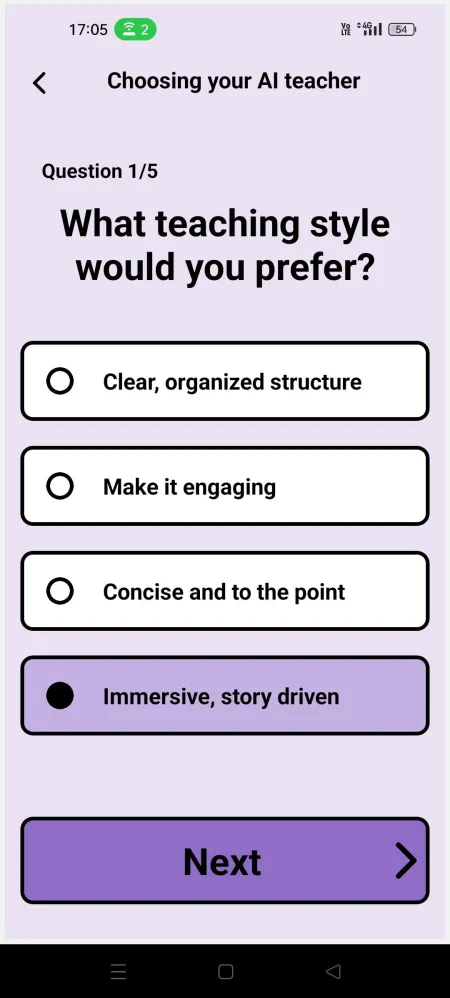

# MindFuel

MindFuel is a mobile application which allows you to generate AI podcasts based on uploaded PDF files.

This project was made for ITFest 2025.

## Screenshots

    
    
    
    

## Usage

- User registers into the application and takes a quiz to identify the AI teacher suited for them. Each AI teacher has their own teaching style and pacing. There are 4 AI teachers the user can obtain: The Storyteller, The Mentor, The Scholar and The Coach.
- User creates a section (a folder) and then accesses it to upload PDF files to it. Usually PDFs in a section are related to one another.
- User uploads a PDF file from their mobile.
- The AI backend processes the PDF file and divides it into logical chapters. Each chapter will have its own audio snippet.
- The AI backend then creates the series of snippets based on the PDF file and on the teacher type the user obtained.
- The user can then listen to the generated podcast as a way to study and learn more about their favourite topics.

## Tech Stack

**Client:** [React Native](https://reactnative.dev/) ([Expo](https://expo.dev/))

**Server:** [Gemma 3](https://blog.google/technology/developers/gemma-3/) (hosted locally through [Ollama](https://ollama.com/library/gemma3)), [Firebase](https://firebase.google.com/), [FastAPI](https://fastapi.tiangolo.com/)

**Languages:** JavaScript, Python

## Contributors (Team MindFuel)

- [@sebastiankalciov](https://www.github.com/sebastiankalciov) (Sebastian Kalciov)
- [@stefars](https://www.github.com/stefars) (Ștefan Mitrea)
- [@Miruna022](https://github.com/Miruna022) (Miruna Mesarașoiu)
- [@natalia-matiut](https://github.com/natalia-matiut) (Ana-Natalia Matiuț)
- [@raulit-0o0](https://www.github.com/raulit-0o0) (Raul-Andrei Ariton)